# DevOps Assignment Report By Safwen Gharbi | CI3

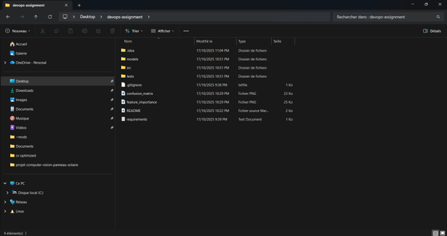

I created a new project folder called devops-assignment on my desktop and copied the provided ML appfiles into it. The folder already contains the src/ directory with the Python code, a tests/ folder, requirements.txt, and the generated plots (confusion_matrix.png, feature_importance.png), which I will use as the starting point for the DevOps assignment.

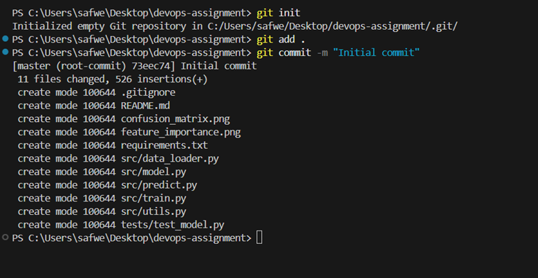

Inside the devops-assignment folder I initialized a new Git repository using git init, staged all existing files with git add ., and created the first commit named "Initial commit". This sets up version control for the project and records the initial state of the ML application before adding any DevOps features.

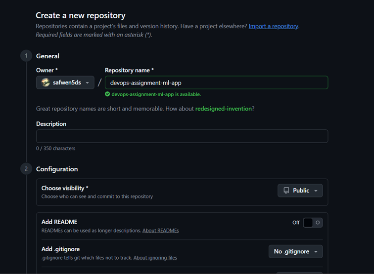

On GitHub I created a new remote repository named devops-assignment-ml-app under my account. This repository will host the code for the assignment and be used as the remote origin for pushing my local commits and for running GitHub Actions CI workflows.

I linked the local Git repository to the new GitHub repository by adding the origin remote and renaming the main branch to main. Finally, I pushed the initial commit to GitHub with git push -u origin main, which uploaded the project and set up tracking between the local main branch and the remote main branch.

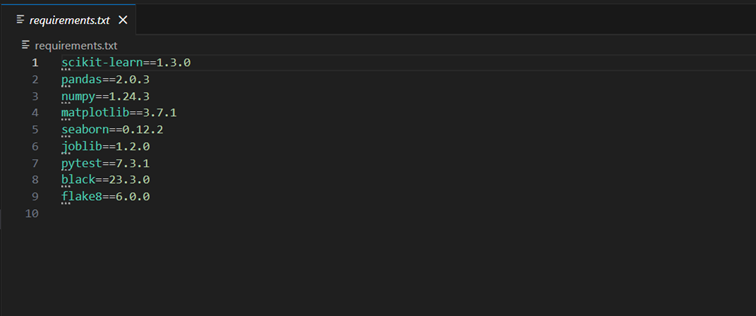

The requirements.txt file listing all Python dependencies for the project, including scikit-learn, pandas, numpy, plotting libraries (matplotlib, seaborn), and development tools like pytest, black, and flake8. This file is used both locally and in CI to install exactly the same versions of the packages.

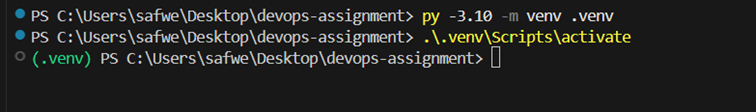

PowerShell terminal where I created a virtual environment with
py -3.10 -m venv .venv and then activated it using
.\.venv\Scripts\activate. The prompt shows (.venv) which confirms that the virtual environment is active and all further commands run in an isolated Python environment.

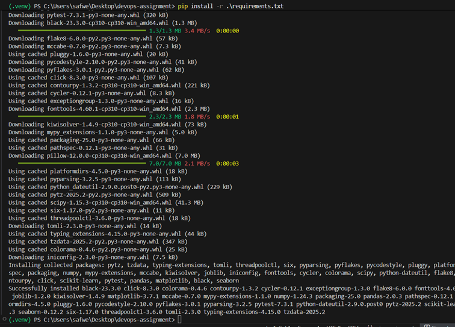

Terminal output of pip install -r .\requirements.txt inside the virtual environment. It shows pip downloading and installing all required packages (scikit-learn, pandas, numpy, pytest, flake8, etc.). This step prepares the environment so the training script, tests, and tooling can run correctly.

Execution of python src\train.py in the virtual environment. The script loads the Iris dataset, prints dataset information (number of features, samples, and classes), trains the IrisClassifier (logistic regression), evaluates it on the test set (accuracy = 0.967), prints the full classification report, and then saves the trained model to models/iris_classifier.pkl and the plots confusion_matrix.png and feature_importance.png.

Execution of python src\predict.py in the virtual environment. The script loads the previously saved model, retrieves the target class names, and performs three example predictions on hard-coded Iris feature vectors. For each example it prints the predicted class (setosa, virginica, versicolor) and the class probabilities, demonstrating that inference works correctly using the trained model.

Inside the virtual environment I installed the testing framework pytest using pip install pytest. The output shows that pytest and its dependencies are already present in .venv, confirming that the environment is ready to run unit tests.

Project structure in VS Code after preparing the code for testing. The src folder now contains an __init__.py file so it behaves as a proper Python package, and the tests folder contains the initial test_model.py test suite. This layout is required so that tests can import modules from src correctly.

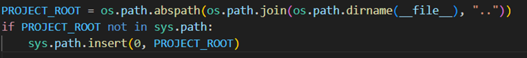

Top of the test file where I compute PROJECT_ROOT using os.path.abspath(os.path.join(os.path.dirname(__file__), "..")) and insert it into sys.path. This ensures the project root is on the Python import path, allowing the tests to import src.data_loader and src.model reliably both locally and in CI.

Test file imports load_iris_data and IrisClassifier from the src package, with # noqa: E402 comments. These comments silence flake8’s “module level import not at top of file” rule (E402), because the imports must come after the sys.path modification.

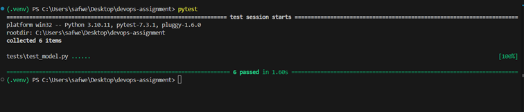

Terminal output of running pytest when only the original tests/test_model.py file is present. Pytest collects 6 test cases from test_model.py and reports that all 6 tests passed successfully, confirming that the base tests for IrisClassifier and load_iris_data() are working.

Updated project tree showing the new file tests/safwen_test.py alongside test_model.py. This file contains the additional unit tests I wrote to satisfy the requirement of “at least 3 meaningful tests” for data format and model sanity checks.

Implementation of test_df_columns_and_rows() in safwen_test.py. This test uses load_iris_as_dataframe() and checks that the returned DataFrame contains all expected columns (sepal length, sepal width, petal length, petal width, target, species), has exactly 150 rows, and that the target column contains the class labels {0, 1, 2}.

Implementation of test_dataset_info_values() in safwen_test.py. This test calls get_dataset_info() and verifies that the metadata is consistent: n_samples == 150, n_features == 4, n_classes == 3, the sum of class_distribution equals n_samples, and the class keys are {0, 1, 2}. It validates the correctness of dataset information returned by the helper function.

Implementation of test_predict_before_training_gives_error() in safwen_test.py. The test creates a fresh IrisClassifier instance, calls predict() without training, and asserts that a ValueError is raised with a message mentioning that the model must be trained. This is a sanity check to ensure the model API fails safely when misused.

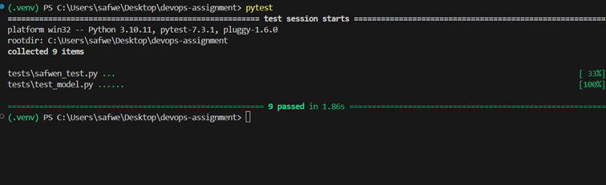

Terminal output after adding safwen_test.py. Pytest now discovers tests in both tests/safwen_test.py and tests/test_model.py, collecting a total of 9 tests. All 9 tests pass, which validates both the original tests and the additional ones I implemented.

Inside the virtual environment I installed the linter flake8 using pip install flake8. The output shows that flake8 and its dependencies (mccabe, pycodestyle, pyflakes) are already present in .venv, confirming the linter is available for local checks and for reproducing the same environment as in CI.

VS Code view of the .flake8 configuration file at the project root. I configured flake8 with max-line-length = 88 and excluded folders such as .venv, .git, .idea, and .pytest_cache from linting. This minimal config defines the style rules enforced on the project and avoids scanning generated or environment folders.

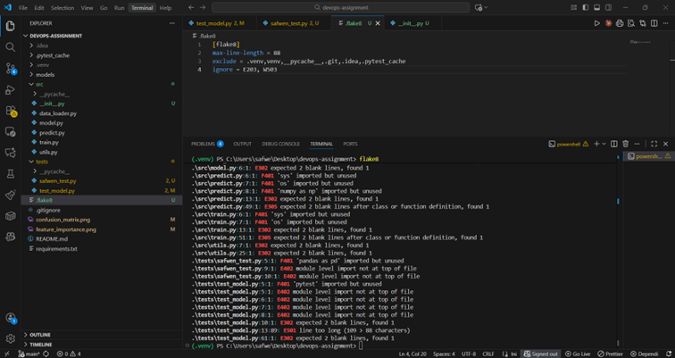

Initial execution of flake8 on the project. The terminal output lists multiple style violations (missing blank lines, unused imports, line length > 88, and E402 “module level import not at top of file”). I used this feedback to clean up the code: removing unused imports, adding proper spacing, shortening long lines, and later ignoring E402 where I intentionally modify sys.path before importing.

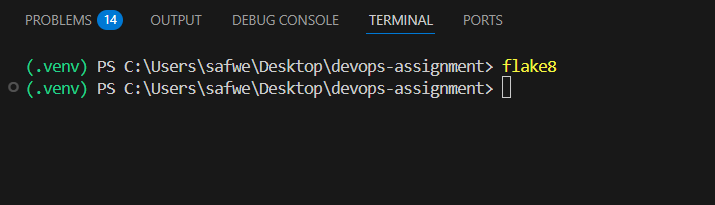

Final execution of flake8 after fixing the reported issues and adjusting the configuration. The command produces no output, which indicates that there are no remaining linting errors and the codebase now satisfies the flake8 style rules defined for the assignment.

In the project root I created the .github folder and the .github/workflows subfolder using mkdir. These directories are required by GitHub Actions, any workflow YAML files placed under .github/workflows/ are automatically detected and executed by GitHub when I push commits or open pull requests.

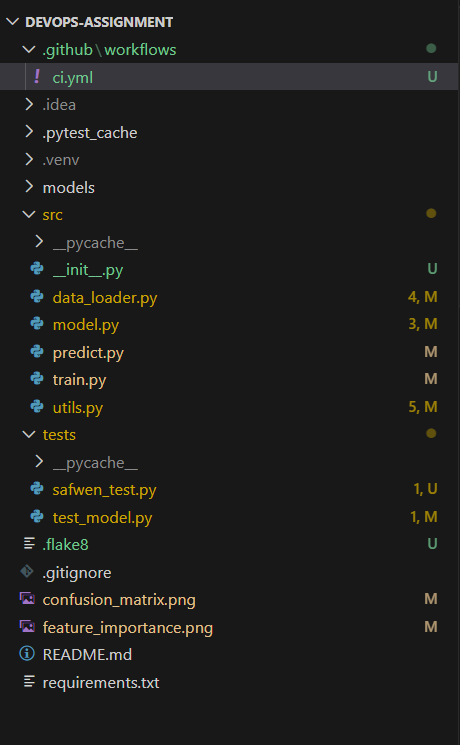

Project structure in VS Code after adding the CI configuration. The .github/workflows/ci.yml file is now present alongside the application source code (src/), tests, Dockerfile, and configuration files. This file defines the GitHub Actions pipeline that will run tests, linting, and Docker builds for the assignment.

View of the ci.yml GitHub Actions workflow. The job build-test runs on ubuntu-latest and performs the required steps for the CI pipeline requested in Task 5.

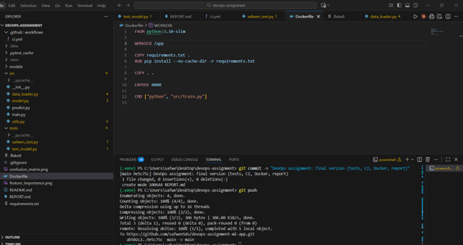

This the final Dockerfile used to containerise the Iris ML app, and the integrated terminal where I committed and pushed the final changes. The Dockerfile uses python:3.10-slim, installs dependencies from requirements.txt, copies the project, exposes port 8000, and runs python src/train.py as the default command. The commit message is "DevOps assignment: final version (tests, CI, Docker, report)", which marks the completed state of the assignment.

git add REPORT.md README.md .github/workflows/ci.yml Dockerfile src tests .flake8 to stage all relevant files.

git commit -m "DevOps assignment: final version (tests, CI, Docker, report)" to create a clear final commit.

git push to send this commit to the remote repository devops-assignment-ml-app on GitHub.
This ensures that the CI workflow, Dockerfile, tests, and report are all available in the online repo.

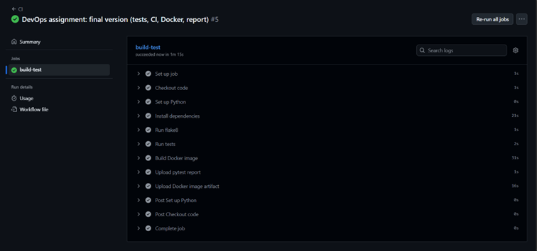

GitHub Actions page showing a successful run of the CI workflow for the commit "DevOps assignment: final version (tests, CI, Docker, report)". The build-test job completed with all steps green: setup, checkout, Python configuration, dependency installation, flake8 linting, pytest tests, Docker image build, and artifact uploads. This confirms that the full CI pipeline works as required by Task 5.

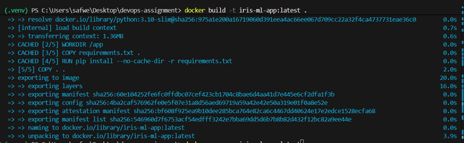

In the project root I built the Docker image for the Iris ML app using
docker build -t iris-ml-app:latest ..
The output shows Docker resolving the python:3.10-slim base image, copying the project files, installing dependencies from requirements.txt, and finally exporting the layers to create the image tagged iris-ml-app:latest. This proves that the Dockerfile builds successfully.

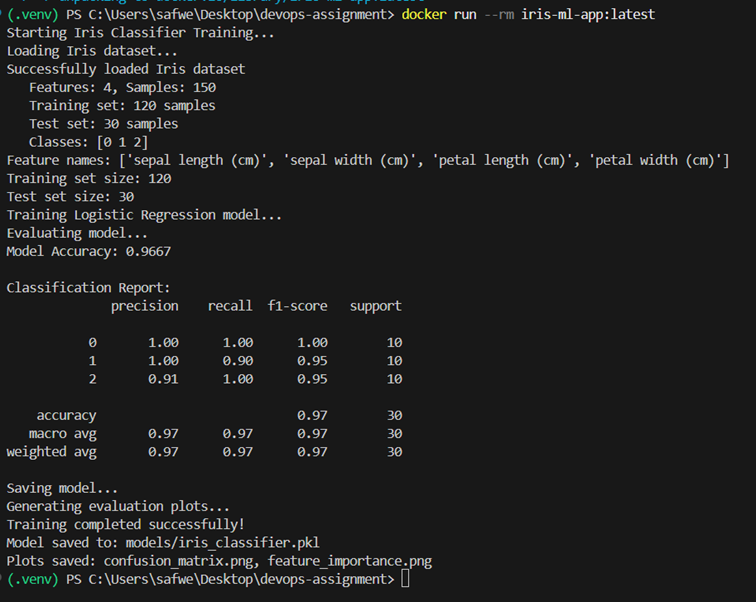

Here I started a container from the iris-ml-app:latest image with
docker run --rm iris-ml-app:latest.
Inside the container, the CMD ["python", "src/train.py"] from the Dockerfile runs the training script: it loads the Iris dataset, prints dataset statistics, trains the logistic regression model, reports an accuracy of 0.967, and saves the model plus evaluation plots. This confirms that the containerised application is fully runnable and performs the same training pipeline as on the host.

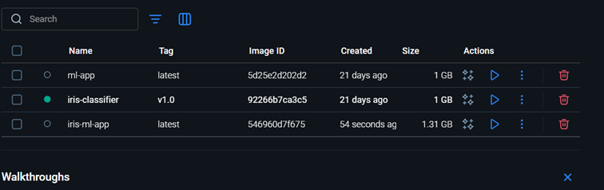

Docker Desktop view showing the list of local images, including iris-ml-app:latest created for this assignment (size 1.31 GB). The presence of this image alongside my older ones (ml-app, iris-classifier) confirms that the build was stored locally and is available to run or push to a registry if needed.
